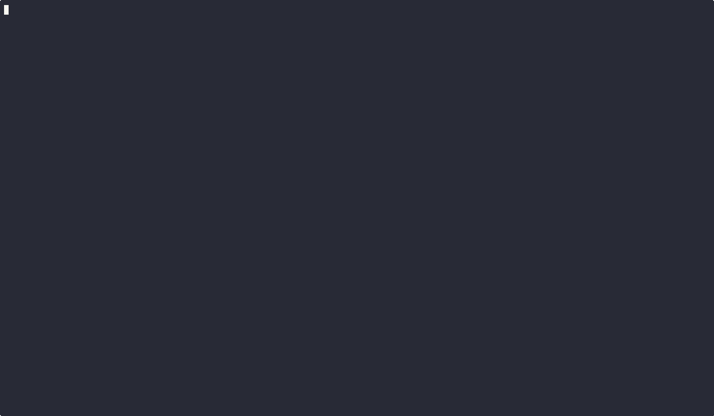

# Voting Smart Contract

This project implements a **Voting Smart Contract** in Solidity that allows:
- **Registering voters**
- **Submitting proposals**
- **Voting on proposals**
- **Counting votes and determining the winner**

## Features

### Voter Management
- **Only the contract owner** can register voters (`addVoter`).
- A voter **can only be registered once**.
- A registered voter can retrieve **their status** using `getVoter`.

### Proposal Management
- **Only registered voters** can submit proposals (`addProposal`).
- A proposal **cannot be empty**.
- Voters can retrieve a **specific proposal** using `getOneProposal`.

### Voting Process
- **Only registered voters** can vote (`setVote`).
- Each voter **can only vote once**.
- A vote **must be for an existing proposal**.
- The contract emits events (`Voted`, `ProposalRegistered`) to track the process.

### Workflow Status
The contract follows a strict **voting workflow** managed by the owner:
1. **RegisteringVoters** → Voters can be registered.
2. **ProposalsRegistrationStarted** → Registered voters can submit proposals.
3. **ProposalsRegistrationEnded** → Proposal submission is closed.
4. **VotingSessionStarted** → Voting begins.
5. **VotingSessionEnded** → Voting closes.
6. **VotesTallied** → Votes are counted, and a winner is determined.

## Installation

Make sure you have **Node.js** installed. Then, clone this repository and install dependencies:

```sh
git clone https://github.com/matrixise/alyra-voting-system-tests.git
cd alyra-voting-system-tests
npm install
```
## Running Tests

To run the unit tests for the smart contract:

```shell
npx hardhat test
```

## Code coverage

Because I use viem, we have to define SOLIDITY_COVERAGE on the CLI 
```shell
SOLIDITY_COVERAGE=true npx hardhat coverage
```

```text
-------------|----------|----------|----------|----------|----------------|
File         |  % Stmts | % Branch |  % Funcs |  % Lines |Uncovered Lines |
-------------|----------|----------|----------|----------|----------------|
 contracts/  |      100 |      100 |      100 |      100 |                |
  Voting.sol |      100 |      100 |      100 |      100 |                |
-------------|----------|----------|----------|----------|----------------|
All files    |      100 |      100 |      100 |      100 |                |
-------------|----------|----------|----------|----------|----------------|

> Istanbul reports written to ./coverage/ and ./coverage.json
```



## Run the Github Actions with act

Install `act` from https://github.com/nektos/act
The tool will use the `.github/workflows/tests.yml`

```shell
act --container-architecture linux/amd64
```


## About the tests

This test suite ensures that the **Voting Smart Contract** functions correctly by covering all critical aspects, including **deployment, workflow transitions, voter management, proposal submission, voting, and tallying votes**.

## **1️⃣ Deployment Tests**

### **📌 Purpose**

- Ensure the contract **deploys correctly**.
- Verify that the **owner** is properly assigned.
- Confirm that the **initial workflow status** is `RegisteringVoters`.

### **✅ Expected Behavior**

- The contract **owner should match** the address that deployed it.
- The contract should **start in the `RegisteringVoters` phase**.

## **2️⃣ Workflow Transitions**

### **📌 Purpose**

- Ensure the contract **follows the correct sequence** of workflow phases.
- Prevent **incorrect state transitions**.

### **✅ Expected Behavior**

- The contract should transition **sequentially** through these phases:
  - `RegisteringVoters` → `ProposalsRegistrationStarted`
  - `ProposalsRegistrationStarted` → `ProposalsRegistrationEnded`
  - `ProposalsRegistrationEnded` → `VotingSessionStarted`
  - `VotingSessionStarted` → `VotingSessionEnded`
  - `VotingSessionEnded` → `VotesTallied`

- Any **attempt to skip or repeat phases should fail**.

## **3️⃣ Voter Management**

### **📌 Purpose**

- Ensure that **only the contract owner** can register voters.
- Prevent **duplicate registrations**.
- Ensure **voters cannot be added after the proposal phase begins**.
- Verify that **events are correctly emitted** when a voter is added.

### **✅ Expected Behavior**

- **Only the owner** can add voters; **other accounts should be rejected**.
- A **voter cannot be added twice**.
- Once **proposal registration starts**, **no more voters can be registered**.
- When a voter is registered, the **`VoterRegistered` event should be emitted**.

## **4️⃣ Proposal Management**

### **📌 Purpose**

- Ensure that **only registered voters** can submit proposals.
- Prevent **empty proposals**.
- Verify that **proposals can only be added during the correct workflow phase**.
- Ensure that **proposal submission events are correctly emitted**.

### **✅ Expected Behavior**

- **Only voters** can submit proposals; **other accounts should be rejected**.
- A proposal **must have a valid description** (cannot be empty).
- **Proposal submission is only allowed** during the `ProposalsRegistrationStarted` phase.
- When a proposal is registered, the **`ProposalRegistered` event should be emitted**.

## **5️⃣ Voting Process**

### **📌 Purpose**

- Ensure that **only registered voters** can vote.
- Prevent **multiple votes from the same voter**.
- Ensure that **votes must be cast on existing proposals**.
- Verify that **events are correctly emitted upon voting**.

### **✅ Expected Behavior**

- **Only registered voters** can vote; **others should be rejected**.
- A voter **can only vote once**; **a second attempt should fail**.
- A vote **must be cast on an existing proposal**; **invalid proposal IDs should be rejected**.
- When a vote is cast, the **`Voted` event should be emitted**.


## **6️⃣ Tallying Votes**

### **📌 Purpose**

- Ensure that **only the contract owner** can tally votes.
- Confirm that the **workflow reaches the final phase**.
- Ensure that the **winning proposal is determined correctly**.
- Verify that **the `WorkflowStatusChange` event is emitted** after tallying votes.

### **✅ Expected Behavior**

- **Only the owner** can tally votes; **other accounts should be rejected**.
- **Votes should be counted**, and the proposal with the **most votes should be marked as the winner**.
- The **workflow should transition to `VotesTallied`** after counting.
- The **`WorkflowStatusChange` event should be emitted** when the voting session ends.

## **📌 Summary of What the Tests Ensure**

| **Test Category**       | **What It Verifies** |
|------------------------|----------------------|
| **Deployment**        | Contract initializes correctly with the right owner and workflow state. |
| **Workflow Transitions** | The contract progresses through the phases in the correct order. |
| **Voter Management**  | Only the owner can register voters; no duplicate registrations; voters cannot be added after proposals start. |
| **Proposal Management** | Only voters can add proposals; empty proposals are rejected; submission occurs in the correct phase. |
| **Voting Process**     | Only voters can vote; one vote per person; votes must be valid; events are emitted properly. |
| **Tallying Votes**     | Only the owner can tally votes; the correct proposal is chosen as the winner; workflow transitions to final phase. |

